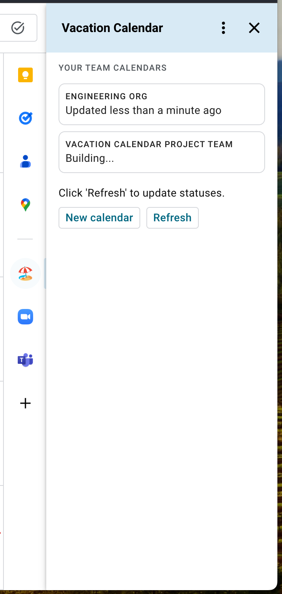
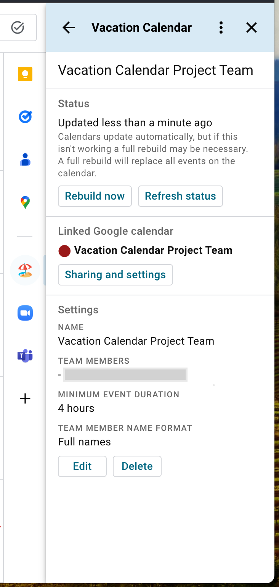

# Vacation Calendar

Vacation Calendar is a Google Calendar add-on that compiles your team's
[out of office](https://support.google.com/calendar/answer/7638168?hl=en&co=GENIE.Platform%3DDesktop#:~:text=Show%20when%20you%E2%80%99re%20out%20of%20office)
events into a single calendar so that you can track availability in one place. The add-on makes it
easy to create many of these calendars: you might have one calendar for the whole team, then
temporary calendars for each project underway. These are just regular Google Calendar calenders and
can easily be customized and shared.

Vacation Calendar only works with corporate Google Workspace accounts and team members must be using
the
[out of office](https://support.google.com/calendar/answer/7638168?hl=en&co=GENIE.Platform%3DDesktop#:~:text=Show%20when%20you%E2%80%99re%20out%20of%20office)
functionality.

## Screenshots

| Home                                                              | Calendar management                                                         |
| ----------------------------------------------------------------- | --------------------------------------------------------------------------- |
|  |  |
